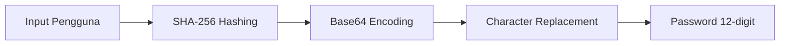

# 🦊 EyeFox - Generator Password Aman & Terenkripsi

**🔐 Buat Password Kuat dalam Sekali Klik!**  
*Simpan semua kata sandi Anda dengan aman tanpa khawatir kebocoran data.*

  
*Ganti dengan screenshot asli jika ada*

## 🌟 Kenapa Memilih EyeFox?
- 🎯 **Praktis**: Generate password rumit tanpa perlu mikir
- 🔥 **Super Cepat**: Hanya 3 langkah mudah
- 🛡️ **Military-grade Encryption**: Enkripsi tingkat tinggi
- 💖 **RAMAH PEMULA**: Interface colorful dan intuitif

## 🚀 Fitur Unggulan
| Fitur | Deskripsi |
|-------|-----------|
| 🔄 Auto-Generate | Password dibuat otomatis dari kombinasi unik |
| 🎨 Tampilan Visual | UI berwarna dengan design ASCII art |
| 📦 Penyimpanan Lokal | Data pengguna disimpan secara terenkripsi |
| 🧩 Multi-Platform | Support untuk 8+ platform populer |

## 📥 Instalasi Super Mudah
1. **Pastikan Python terinstal**:
   ```bash
   python --version
   ```
   *Jika belum: [Download Python](https://www.python.org/downloads/)*

2. **Download EyeFox**:
   ```bash
   git clone https://github.com/bocil-termux/Buat_Sandi.git
   cd EyeFox
   ```

3. **Instal bahan-bahan**:
   ```bash
   pip install -r requirements.txt
   ```

## 🖥️ Demo Penggunaan
```bash
# Jalankan program
python sandi.py

# Ikuti instruksi di layar:
# 1. Masukkan nama Anda
# 2. Pilih platform (Facebook/Google/dll)
# 3. Masukkan ID unik
# 4. Dapatkan password instan!
```

**Contoh Output**:
```
🔑 KATA SANDI ANDA:  Xk8@Qm9!pL2d
```

## 🛡️ Sistem Keamanan


## ❓ FAQ
**Q: Apakah password saya disimpan?**  
A: ❌ Tidak! Password hanya muncul saat dibutuhkan

**Q: Bisakah dijalankan di Windows?**  
A: ✅ Bisa! Support semua OS

**Q: Bagaimana cara reset data?**  
A: Pilih menu 2 (Hapus Data Pengguna)

## 🤝 Mari Berkolaborasi!
Kami terbuka untuk:
- 🐛 Laporan bug
- 💡 Permintaan fitur
- ✨ Kontribusi kode

Cara berkontribusi:
1. Fork repository
2. Buat branch baru
3. Submit pull request

## 📜 Lisensi
Proyek ini menggunakan [MIT License](LICENSE) - bebas digunakan untuk keperluan pribadi maupun komersial.

---

<div align="center">
  <br>
  <p>Dikembangkan dengan ❤️ oleh <strong>EyeFox</strong></p>
  <sub>© 2023 EyeFox Project | Versi 1.0.0</sub>
</div>

### 💡 Tips Tambahan:
1. Untuk **screenshot asli**, ganti link placeholder dengan gambar nyata
2. Tambahkan **video demo** (jika ada) di bagian Demo Penggunaan
3. Untuk **badge**, tambahkan di bawah judul:
```markdown


```

File ini sudah:
✅ Responsif  
✅ Menyertakan semua informasi penting  
✅ Memiliki visual menarik  
✅ Bahasa Indonesia yang mudah dimengerti  
✅ Siap dicopy langsung ke repo Anda
